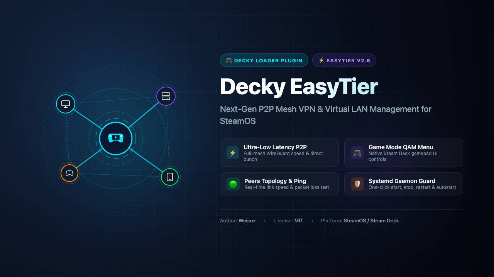

# Decky EasyTier

<p align="center">
  
</p>

<p align="center">
  <a href="https://github.com/SteamDeckHomebrew/decky-loader"></a>
  <a href="https://github.com/EasyTier/EasyTier"></a>
  <a href="LICENSE"></a>
</p>

<p align="center">
  <b>English</b> | <a href="README_zh.md">简体中文</a> | <a href="README_ja.md">日本語</a>
</p>

---

**Decky EasyTier** is a [Decky Loader](https://github.com/SteamDeckHomebrew/decky-loader) plugin tailored for Steam Deck, providing seamless management and real-time monitoring of [EasyTier](https://github.com/EasyTier/EasyTier) decentralized mesh VPN networks directly within SteamOS Gaming Mode.

---

## 🌟 Key Features

- 🎮 **Native Gaming Mode Integration**: Seamlessly embeds into the SteamOS Quick Access Menu (QAM `...` button), fully operable via gamepad.
- 🚀 **Zero-Hassle One-Click Installation**: Supports one-liner terminal script and in-app automated core downloader—no manual binary copying required.
- 📱 **Standalone Web Management Console**: Built-in lightweight web server (default port `21010`). Manage configurations via phone or PC browser over local Wi-Fi without struggling with on-screen typing.
- 🟢 **Real-Time Network Diagnostics**: Instant visualization of Virtual IP, hostname, NAT penetration type (FullCone / Symmetric, etc.), and Peer ID.
- 🌐 **Peer Topology & Traffic Monitoring**: Live peer lists displaying connection routes (P2P direct / relay), round-trip ping latency, and real-time RX/TX bandwidth.
- ⚡ **Integrated Ping Tool**: Measure real network latency to any connected peer node with a single click.
- ⚙️ **Automatic Systemd Service Management**: Start, stop, restart, and enable auto-start on boot via systemd.

---

## 📦 Installation

### Method 1: One-Click Terminal Install (Recommended ⚡)
Switch to Steam Deck **Desktop Mode**, open **Konsole**, and paste the following command:

```bash
curl -fsSL https://raw.githubusercontent.com/Weicoz/decky-easytier/main/install.sh | bash
```

> **Fast Mirror** (for users experiencing slow GitHub access):
> ```bash
> curl -fsSL https://ghfast.top/https://raw.githubusercontent.com/Weicoz/decky-easytier/main/install.sh | bash
> ```

> 💡 **What the script does automatically:**
> 1. Detects system architecture (`x86_64`) and downloads the latest official EasyTier release;
> 2. Extracts `easytier-core` and `easytier-cli`, configuring Linux network capabilities (`cap_net_admin`);
> 3. Generates the default configuration and registers the `systemd` daemon service;
> 4. Deploys the `decky-easytier` plugin and triggers Decky Loader reload.

---

### Method 2: In-App One-Click Core Install (No Terminal Needed 🎮)
If you have already installed the plugin via Decky Plugin Store or archive:

1. In Steam Gaming Mode, press the Quick Access button (`...`) to open Decky Loader.
2. Select **EasyTier**.
3. You will see a notification banner: **【🚀 EasyTier Core Setup Required】**. Simply click **【Download & Install EasyTier Core】**.
4. The plugin will automatically download the official binary, set up system permissions, and launch the service—**no Desktop Mode or terminal commands required!**

---

### Method 3: Manual Installation & Local Build (Advanced Developers 🛠️)
1. Clone repository:
   ```bash
   git clone https://github.com/Weicoz/decky-easytier.git /home/deck/homebrew/plugins/decky-easytier
   ```
2. Build frontend (Requires Node.js >= 18 & pnpm):
   ```bash
   cd /home/deck/homebrew/plugins/decky-easytier
   pnpm install
   pnpm run build
   ```
3. Place EasyTier Binaries:
   - Core binaries: `/home/deck/.local/bin/easytier-core` and `easytier-cli` (`chmod +x` required)
   - Configuration: `/home/deck/.config/easytier/config.toml`
   - Service unit: `/etc/systemd/system/easytier.service`

---

## 🌐 Web Console Guide

The plugin runs an embedded HTTP daemon listening on `http://127.0.0.1:21010` by default.
- **Open on Device**: Tap **【Open Web Console】** inside the Decky plugin menu to launch the Steam browser.
- **Remote Management**: Check the **LAN URL** displayed in the plugin (e.g., `http://192.168.10.x:21010`). Open this link on your smartphone or PC connected to the same Wi-Fi network to configure network identity and peers easily.

---

## 📄 License

This project is licensed under the [MIT License](LICENSE).
EasyTier is copyrighted by its respective authors.
